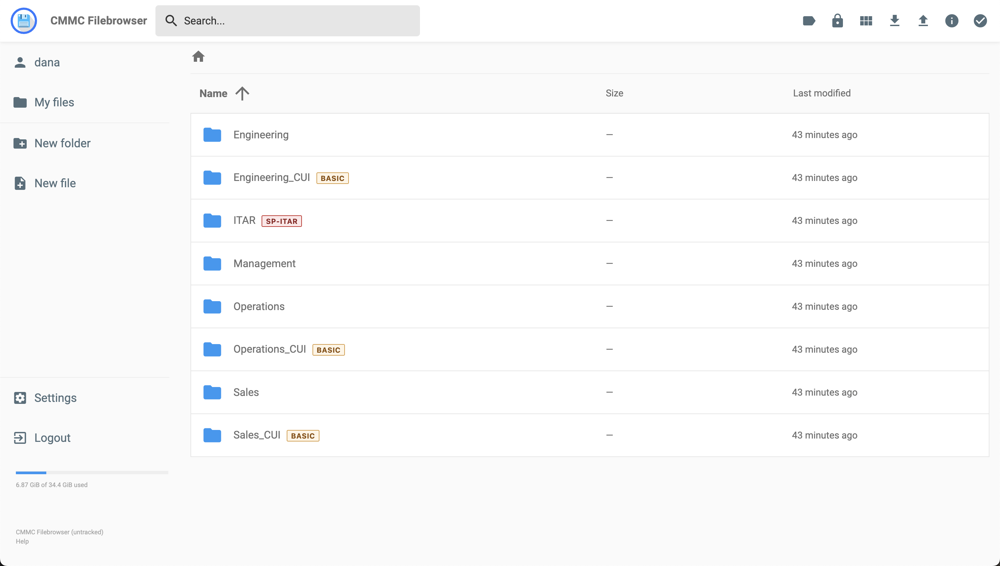
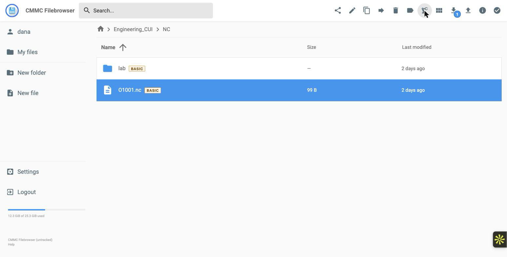
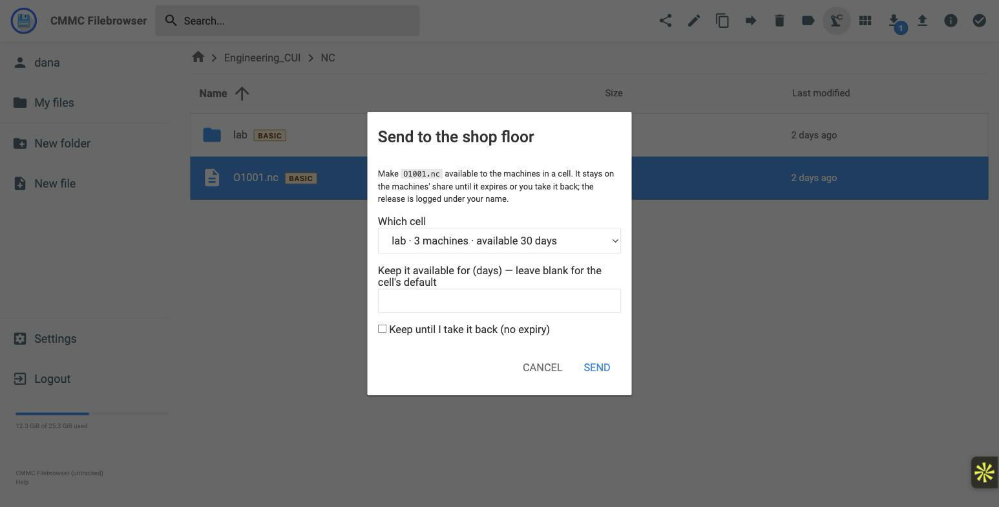
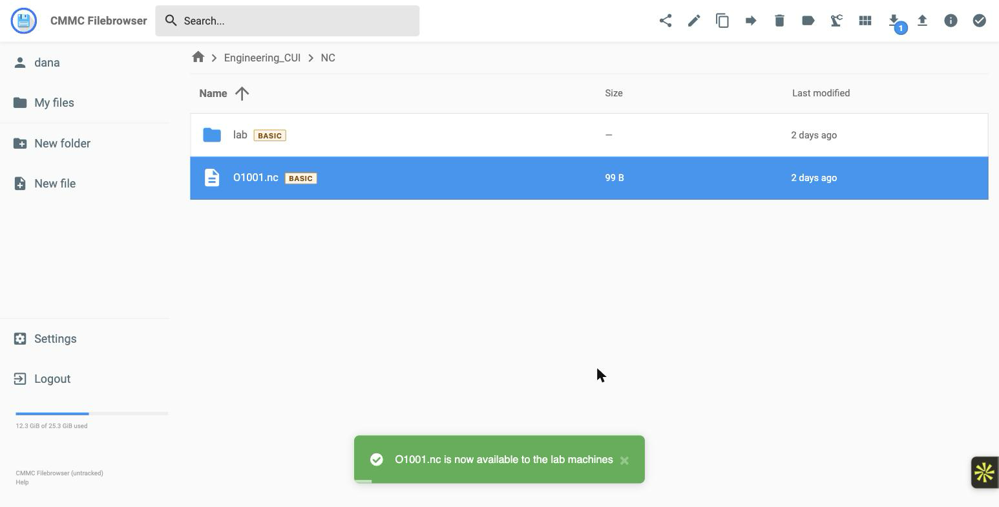
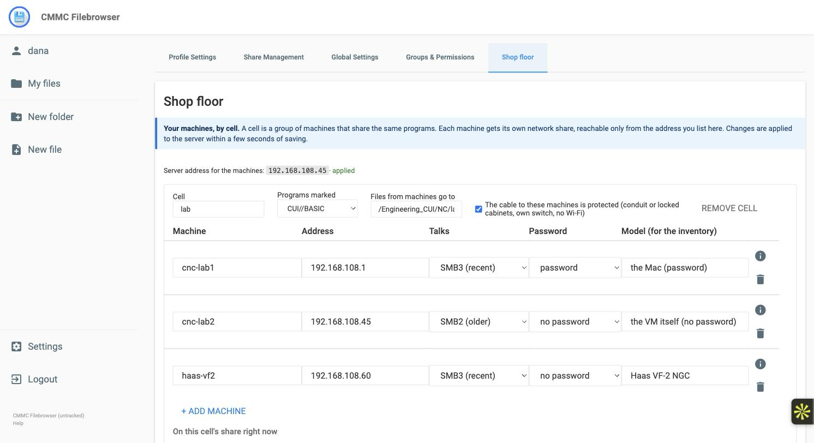

# Open-CMMC

[](./LICENSE)
[](./SECURITY.md)
[](./go.mod)
[](./docs/compliance-posture.md)
[](./docs/compliance-posture.md)
[](https://trout.software)



On-prem storage for **Controlled Unclassified Information (CUI)** at **CMMC Level 2 / NIST SP 800-171 Rev 2**. A hardened fork of [filebrowser/filebrowser](https://github.com/filebrowser/filebrowser) (Apache-2.0) that runs as a single Go binary on RHEL 9 or AlmaLinux 9 with FIPS mode enabled.

Authentication is externalized to OIDC (Keycloak, Entra GCC High, Okta Gov, Ping). Files are encrypted at rest (AES-256-GCM envelope), scanned on upload (ClamAV fail-closed), and every action emits a tamper-evident audit event.

> **Why now:** CMMC Program Final Rule is in effect (32 CFR 170); **Phase 2 begins 2026-11-10** and requires a C3PAO assessment for Level 2 contracts. FIPS posture inherits OpenSSL CMVP #4774 via RHEL / Alma `go-toolset` — appliances ship audit-ready.

---

## Table of contents

- [Architecture](#architecture)
- [NIST control mapping](#nist-control-mapping)
- [SSP base](#ssp-base)
- [Installation](#installation)
- [Shop-floor SMB delivery](#shop-floor-smb-delivery)
- [Operator guides](#operator-guides)
- [Wazuh — additional CMMC coverage](#wazuh--additional-cmmc-coverage)
- [Supported IdPs](#supported-idps)
- [Project status](#project-status)
- [License](#license--upstream-attribution)
- [Appendix A: Gap analysis (pre-fork baseline)](#appendix-a-gap-analysis-pre-fork-baseline)

---

## Architecture

Full architecture: [`docs/architecture.md`](./docs/architecture.md) — topology, components, data + audit flows, firewall rules, key management, TLS profile.

**Turnkey shape:** one VM, one command, the whole CUI enclave — `cmmc-filebrowser` plus a bundled **Keycloak-FIPS** OIDC IdP. Monitoring (Wazuh) and external auth / SIEM integrations are optional add-ons layered on top.

```
┌─── CUI enclave · single VM · RHEL 9 / Alma 9 FIPS ───────────────────┐
│                                                                      │
│   cmmc-filebrowser  ◄── OIDC + MFA ──►  cmmc-keycloak                │
│     Go · TLS 1.3 FIPS                    (bundled OIDC IdP)          │
│         │                                                            │
│         │ JSON audit                                                 │
│         ▼                                                            │
│     journald  ──►  rsyslog (mTLS)                                    │
│                                                                      │
│   Files:  AES-256-GCM envelope per object · KEK in TPM / HSM         │
│   BoltDB: envelope-encrypted rows · HMAC audit chain                 │
│                                                                      │
│   ┌ (optional) Wazuh agent + manager + indexer + dashboard ┐         │
│   │   enable with:  install.sh deploy --with-wazuh         │         │
│   └────────────────────────────────────────────────────────┘         │
│   ┌ (optional) cmmc-smb — shop-floor SMB shares ───────────┐         │
│   │   enable with:  install.sh deploy --with-smb --ot-ip … │──► CNC  │
│   │   release → read-only share · return → scan → cabinet  │◄── PLC  │
│   └────────────────────────────────────────────────────────┘         │
└──────────────────────────────────────────────────────────────────────┘

   Auth   (optional federation) ─►  Entra GCC-H · Okta Gov · Ping
   SIEM   (optional forward)    ─►  Splunk · Sentinel · Elastic
```

**Deploy shapes:**

- **Turnkey all-in-one (default)** — bundled Keycloak + Wazuh, `install.sh deploy --with-wazuh` on a fresh RHEL/Alma 9 VM
- **Federated IdP + bundled SIEM** — customer's Entra GCC-H / Okta Gov / Ping for auth, bundled Wazuh for monitoring
- **Bundled IdP + federated SIEM** — bundled Keycloak, forward audit to customer Splunk / Sentinel / Elastic
- **Fully federated** — customer's IdP + SIEM; appliance runs only the filebrowser core
- **Behind Trout Access Gate** — Gate fronts TLS + x509/PIV + egress allow-list, stacks on any of the above
- **With shop-floor SMB** — `deploy --with-smb --ot-ip <addr>` shows CNC / OT machines a share from the same host; see [Shop-floor SMB delivery](#shop-floor-smb-delivery)

---

## NIST control mapping

> **Why do all control IDs start with `3.`?** NIST SP 800-171 Rev 2 is organized as Section 1 (purpose), Section 2 (scope), and **Section 3: The Requirements**. All 110 controls live in Section 3, so they're numbered `3.X.Y` where `X` is the family (1–14) and `Y` is the control within that family. The leading `3.` isn't meaningful — it's just the chapter number in the document.

Full per-control coverage: [`docs/compliance-posture.md`](./docs/compliance-posture.md) (positive posture, installed) or [`docs/gap-analysis.md`](./docs/gap-analysis.md) (pre-fork baseline). Family-level summary below.

**Legend:** ✅ Open-CMMC directly · 🟢 Wazuh extends · 📋 Customer SSP · 🏢 Host / facility

| Family | Coverage | Scope | Where Open-CMMC addresses it |
|---|---|---|---|
| **3.1** Access Control (22) | ✅ 18 · 🟢 3 · 📋 1 | OIDC + per-folder ACL + session mgmt | `cmmc/auth/oidc/`, `cmmc/authz/folderacl/`, `http/cmmc_session_idle.go` |
| **3.2** Awareness & Training (3) | 📋 3 | Policy / procedure | Customer SSP — not product-scope |
| **3.3** Audit & Accountability (9) | ✅ 6 · 🟢 3 | Structured events, HMAC chain, correlation IDs | `cmmc/audit/`, `config/rsyslog/`, `config/wazuh/` |
| **3.4** Configuration Mgmt (9) | ✅ 6 · 🟢 3 | Config-change audit, CM baselines | `http/cmmc_enforcement.go`, SSP procedures |
| **3.5** Identification & Auth (11) | ✅ 11 | MFA, replay-resistant, FIPS crypto, passkeys | `cmmc/auth/oidc/`, `cmmc/auth/session/`, WebAuthn policy |
| **3.6** Incident Response (3) | ✅ 1 · 🟢 2 | Audit forwarder + SIEM decoders | `config/wazuh/rules/`, [`audit-forwarder.md`](./docs/audit-forwarder.md) |
| **3.7** Maintenance (6) | ✅ 2 · 🏢 4 | Privileged-access audit, NOREMAUTH | SSP + Access Gate step-up |
| **3.8** Media Protection (9) | ✅ 9 | CUI marking, envelope encryption, move/copy rules | `cmmc/marking/`, `cmmc/crypto/envelope/`, `http/cmmc_enforcement.go` |
| **3.9** Personnel Security (2) | 📋 2 | Policy | Customer SSP |
| **3.10** Physical Protection (6) | 🏢 6 | Policy / host-layer | Customer facility + host SSP |
| **3.11** Risk Assessment (3) | 🟢 3 | SBOM, vulnerability mgmt | CI workflow, `govulncheck` + trivy in release pipeline |
| **3.12** Security Assessment (4) | ✅ 2 · 📋 2 | SSP, POA&M | This repo + customer SSP |
| **3.13** System & Comms Protection (16) | ✅ 14 · 🏢 2 | FIPS TLS, egress deny, FIPS crypto | `cmmc/crypto/tlsprofile/`, `cmmc/crypto/fips/`, firewalld |
| **3.14** System & Info Integrity (7) | ✅ 3 · 🟢 4 | Scan-on-upload, malware-sig currency | `cmmc/scan/clamav/`, `update-ca-trust` |
| **Total** | **✅ 72 · 🟢 18 · 📋 8 · 🏢 12** (= 110) | | |

---

## SSP documents

Open-CMMC is the **product + evidence base** for a System Security Plan. It doesn't replace the customer's SSP, but it supplies every artifact an assessor needs:

| Artifact | Path |
|---|---|
| Compliance posture (per-control coverage, installed) | [`docs/compliance-posture.md`](./docs/compliance-posture.md) |
| Gap analysis (pre-fork baseline, per-control statements) | [`docs/gap-analysis.md`](./docs/gap-analysis.md) |
| Architecture (data-flow diagrams, boundaries, inheritance) | [`docs/architecture.md`](./docs/architecture.md) |
| IdP setup (Entra GCC-H / Keycloak / Okta Gov) | [`docs/oidc-providers.md`](./docs/oidc-providers.md) |
| Audit pipeline (rsyslog-ossl mTLS) | [`docs/audit-forwarder.md`](./docs/audit-forwarder.md) |
| Wazuh integration | [`docs/wazuh-integration.md`](./docs/wazuh-integration.md) |
| Operator 2FA + passkey walkthrough | [`docs/operator-2fa.md`](./docs/operator-2fa.md) |
| Deployment (RHEL/Alma 9, FIPS) | [`docs/almalinux9-setup.md`](./docs/almalinux9-setup.md) |
| Backup, restore, recovery drill | [`docs/backup-restore.md`](./docs/backup-restore.md) |
| Day-2 operations (upgrade, user lifecycle) | [`docs/day2-operations.md`](./docs/day2-operations.md) |
| Keycloak realm (policy + PKCE + amr) | [`docs/keycloak-setup.md`](./docs/keycloak-setup.md) |

Typical SSP workflow: the customer's compliance team copies per-control statements from `gap-analysis.md`, documents ODPs (organizationally-defined parameters), adds site-specific evidence (retention, ticketing), and produces the SSP + POA&M for C3PAO review.

---

## Installation

### Option 1 — from a GitHub Release tarball (recommended)

No build toolchain needed on the target. Pick the arch that matches `uname -m`:

```bash
# On the target RHEL 9 / AlmaLinux 9 / Rocky 9 host — enable FIPS first
sudo fips-mode-setup --enable && sudo reboot

# After reboot
sudo dnf install -y podman jq curl iproute firewalld openssl policycoreutils-python-utils
sudo systemctl enable --now firewalld

# Download the release (pick amd64 or arm64 to match uname -m)
ARCH=amd64   # or arm64
VER=v1.0.0
TAR=cmmc-filebrowser-$VER-linux-$ARCH.tar.gz
curl -LO https://github.com/TroutSoftware/Open-CMMC/releases/download/$VER/$TAR
curl -LO https://github.com/TroutSoftware/Open-CMMC/releases/download/$VER/$TAR.sha256
sha256sum --check $TAR.sha256

# Extract + deploy. FB_ADMIN_USER names the one administrator the
# appliance is provisioned with; the temporary password is generated
# and printed once during the Keycloak phase.
tar -xzf $TAR
sudo FB_ADMIN_USER=jsmith \
  cmmc-filebrowser-$VER-linux-$ARCH/config/install.sh deploy --from-release "$(realpath $TAR)"
```

> **Evaluating rather than deploying?** Swap `FB_ADMIN_USER=jsmith` for
> a `--demo` flag to get a five-person sample org (Dana, Alice, Bob,
> Carol, Dave) with a shared temporary password. Those accounts use a
> password published in this repository — never point them at real CUI.

In ~3 minutes: TLS-enabled filebrowser on `https://<host>:8443`, Keycloak OIDC on `https://<host>:8081`, systemd units, firewalld rules, self-signed CA + leaf cert (replaceable with customer PKI for prod), audit stream to journald, and envelope encryption (AES-256-GCM per-file) on by default with an auto-generated KEK at `/etc/cmmc-filebrowser/kek.bin`.

> **Back up that KEK before you store anything.** It decrypts every file in the cabinet, it exists only on this host, and there is no escrow or vendor copy — lose it and the cabinet is unrecoverable. Run `sudo config/install.sh backup <dir>` and move the result to separate media. See [`docs/backup-restore.md`](./docs/backup-restore.md).

Air-gap: same commands, just download the tarball on an internet-connected host and `scp` it to the target before the `tar -xzf` step. `install.sh --from-release` skips the build phases entirely — no Go, Node, or pnpm needed on the target.

### Option 2 — from source

For development or when you want to patch before installing:

```bash
git clone https://github.com/TroutSoftware/Open-CMMC.git open-cmmc
cd open-cmmc
sudo FB_ADMIN_USER=jsmith config/install.sh deploy   # or: deploy --demo
```

Needs Go 1.25, Node ≥18.12, and pnpm on the host. Same end state as Option 1.

### Common subcommands

```bash
sudo config/install.sh deploy --with-wazuh     # baseline + bundled Wazuh SIEM
sudo config/install.sh deploy --with-smb --ot-ip 10.20.0.5   # + shop-floor SMB shares
sudo config/install.sh backup <dir>            # full backup (config, keys, cabinet, realm)
sudo config/install.sh restore <dir>           # restore from a backup
sudo config/install.sh status                  # health check
sudo config/install.sh uninstall               # stop + disable (state preserved)
sudo config/install.sh uninstall --wipe-state  # full clean slate
```

Full deployment guide: [`docs/almalinux9-setup.md`](./docs/almalinux9-setup.md).

---

## Shop-floor SMB delivery

Most CNC and OT controllers speak SMB, not HTTPS. With `--with-smb`, the
same server also shows your machines a network share — the kind a Haas,
Mazak or Fanuc already knows how to read.

- In the web UI, select a program and click the robot-arm icon (**Send to
  shop floor**), pick the cell. It appears on the machines' share and
  disappears again after 30 days (or when you take it back).
- Anything a machine writes back is checked, virus-scanned and filed into
  the cabinet under that machine's name.
- The cabinet itself is never shared; machines only ever see what someone
  sent them.
- Machines are managed in the web UI (**Settings → Shop floor**): add or
  remove cells and machines, rename, change addresses — applied within
  seconds.









```bash
sudo config/install.sh deploy --with-smb --ot-ip 10.20.0.5   # (or later: sudo config/smb/install-smb.sh --ot-ip 10.20.0.5)
# then add your machines in the web UI (Settings → Shop floor), or edit /etc/cmmc-smb/cells.yaml
sudo cmmc-smb useradd haas-vf2                                # prints a card with what to type into the controller
```

Machines don't need a password by default (the network cable is the
control — you attest it's protected); give a machine a password if you
want an encrypted connection. Setup, the physical-path requirement and
what to put in the SSP: [`docs/smb-shop-floor.md`](./docs/smb-shop-floor.md).

---

## Operator guides

- **[2FA + passkey enrollment](./docs/operator-2fa.md)** — TOTP (default) and FIDO2 security keys (passwordless peer). Includes DNS prerequisites for passkey flows.
- **[Wazuh SIEM integration](./docs/wazuh-integration.md)** — agent install, decoder + rule drop-in, bundled-mode podman-compose.
- **[Wazuh endpoint agents](./docs/wazuh-endpoint-agents.md)** — Windows / Linux / macOS agents for CMMC 3.14 coverage.
- **[Audit forwarder](./docs/audit-forwarder.md)** — rsyslog-ossl mTLS for Splunk / Sentinel / Elastic.
- **[Backup and restore](./docs/backup-restore.md)** — what must survive, how to verify a backup, and why the KEK is irreplaceable.
- **[Day-2 operations](./docs/day2-operations.md)** — upgrades, adding and removing users, health checks, audit review.
- **[Shop-floor SMB delivery](./docs/smb-shop-floor.md)** — releasing NC programs to CNC / OT controllers over SMB and taking their output back.


*Per-user activity view (NIST 3.3.1 / 3.3.2) — every CUI mark change, preview, and admin action is stamped with a correlation id and emitted to the audit stream.*

---

## Wazuh — additional CMMC coverage

Wazuh is the **default recommended SIEM + endpoint-monitoring stack** for Open-CMMC (architecture decision D5). Running without Wazuh is valid — audit still lands in journald locally — but Wazuh extends coverage into families the filebrowser process alone can't satisfy.

**Open-CMMC alone covers ~55 of 110 controls** directly in product code (3.1, most of 3.3, 3.5, 3.8, 3.13).

**Wazuh adds ~20 more**, taking the deployed stack to ~75 of 110:

| Family | Controls | How Wazuh covers it |
|---|---|---|
| **3.3** Audit | 3.3.4, 3.3.7, 3.3.8 | Central log retention + tamper protection; audit-failure alerting |
| **3.4** CM | 3.4.1, 3.4.3, 3.4.7 | FIM on binary, `/etc/cmmc-filebrowser/`, systemd units |
| **3.6** Incident Response | 3.6.1, 3.6.2, 3.6.3 | Correlation rules turn audit events into SOC-actionable incidents |
| **3.11** Risk Assessment | 3.11.2, 3.11.3 | Daily vulnerability scan of host packages |
| **3.14** System & Info Integrity | 3.14.1–3.14.7 | Host antimalware, signature auto-update, rootcheck, anomaly detection |
| **3.1** AC (cross-system) | 3.1.1, 3.1.12, 3.1.20 | Endpoint agents on operator workstations catch lateral access |

The remaining ~35 controls are personnel / physical / policy — customer SSP domain by design.

**Deployment shapes:**

- **Agent-only** — customer's own Wazuh manager; appliance runs agent + our filebrowser decoder/rules ([`docs/wazuh-integration.md`](./docs/wazuh-integration.md))
- **Bundled** — `sudo config/install.sh deploy --with-wazuh` brings up manager + indexer + dashboard

**Other SIEMs** — Splunk / Sentinel / Elastic connect via rsyslog-ossl ([`docs/audit-forwarder.md`](./docs/audit-forwarder.md)); the 3.4 / 3.14 coverage reverts to a customer-tool integration in those deployments.

---

## Supported IdPs

| IdP | Use case | Docs |
|---|---|---|
| **Keycloak (bundled)** | Air-gap, sovereignty, single-appliance | [`keycloak-setup.md`](./docs/keycloak-setup.md) |
| **Entra ID (Microsoft GCC High)** | Customers on M365 GCC-H | [`oidc-providers.md`](./docs/oidc-providers.md) |
| **Okta Gov / Okta Fed** | Okta-centric shops | [`oidc-providers.md`](./docs/oidc-providers.md) |
| **Ping Identity** | PingFederate deployments | [`oidc-providers.md`](./docs/oidc-providers.md) |

---

## Project status

[Trout Software](https://www.trout.software) is the primary maintainer. Community contributions welcome via PR.
Formal reviews and questions by RPO/C3PAO welcome via tickets, or contact <hello@trout.software>.
For commercial support / customer deployments, contact <hello@trout.software>.

---

## License + upstream attribution

**Apache-2.0** — same as upstream filebrowser.

Open-CMMC started from [filebrowser/filebrowser](https://github.com/filebrowser/filebrowser) v2.63.2 (commit `dd53644`, 2026-04-17). CMMC-specific hardening lives under:

- `cmmc/` — new Go packages (auth/oidc, auth/session, authz, audit, marking, crypto, scan, cabinet)
- `config/` — installer + systemd units + Keycloak bootstrap + rsyslog + Wazuh integration assets
- `docs/` — architecture, gap analysis, operator + deployment guides
- `scripts/build-release.sh` — air-gap-friendly release packager

Upstream filebrowser functionality is preserved where it doesn't conflict with CMMC requirements; removed / hardened where it did (e.g., the default no-auth mode refuses to boot; public shares are rejected for CUI-marked items). Bug reports for upstream-derived code belong upstream first; Open-CMMC-specific bugs + features in [this repo's issues](https://github.com/TroutSoftware/Open-CMMC/issues).