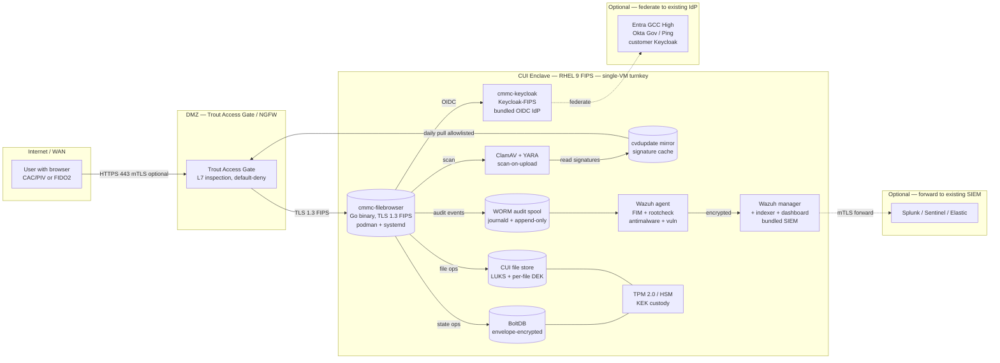
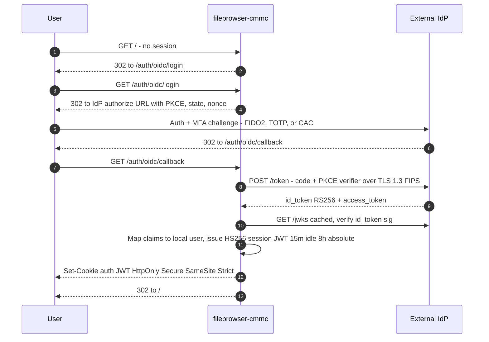
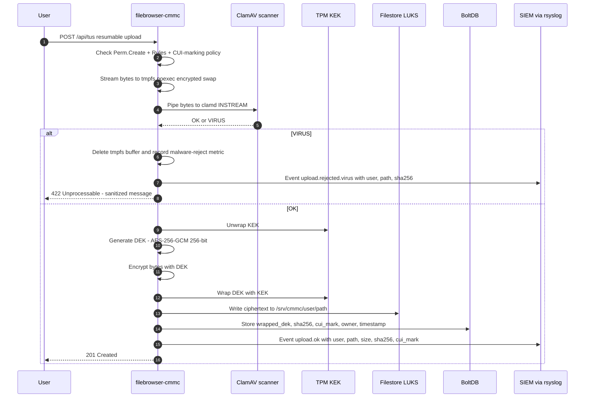
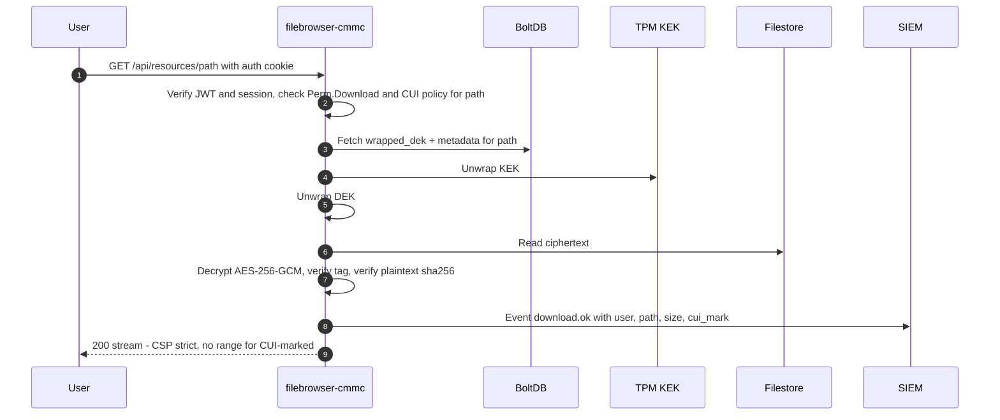
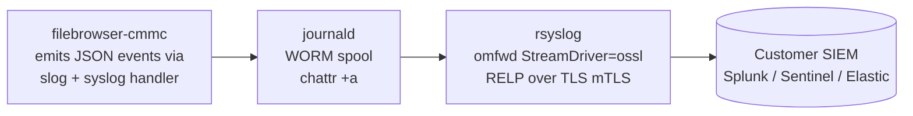

# Open-CMMC — v1 Architecture

**Purpose:** hardened fork of filebrowser for on-prem CUI file storage at CMMC L2.
**Target date:** C3PAO-ready by 2026-Q3; CMMC Phase 2 mandatory 2026-11-10.
**Baseline crypto:** FIPS 140-3 (FIPS 140-2 goes historical 2026-09-21).
**Companion document:** [gap-analysis.md](./gap-analysis.md) — mapping of every Rev 2 control to current state and remediation.

---

## 1. Deployment topology

**Turnkey shape:** Open-CMMC ships as a single-VM appliance containing the filebrowser application, a bundled **Keycloak-FIPS** OIDC IdP, and a bundled **Wazuh** stack (agent + manager + indexer + dashboard). An operator who runs `sudo config/install.sh deploy --with-wazuh` on a fresh RHEL 9 / AlmaLinux 9 host gets the entire enclave in one command. Customers who already operate an IdP or SIEM can federate / forward out — both paths are first-class, shown dashed below.



> **Not shown** — no outbound SMTP / email / share-portal surface. External CUI sharing is out of MVP scope (see § 10). Customers route outbound CUI through their existing specialized provider.

---

## 2. Components

| Component | Role | Version anchor | In CUI scope? |
|---|---|---|---|
| **filebrowser-cmmc** | Hardened fork; serves UI + API; terminates TLS | fork of upstream v2.63.2 | Yes — primary |
| **RHEL 9 / AlmaLinux 9 (FIPS mode)** | OS baseline with inherited FIPS 140-3 OpenSSL. Both ship identical `openssl-libs` under CMVP #4774; AlmaLinux supported for subscription-free deployments — see [almalinux9-setup.md](./almalinux9-setup.md) | RHEL 9.4+ or AlmaLinux 9.4+ | Yes |
| **RHEL / Alma go-toolset** | FIPS-aware Go toolchain (cgo → platform OpenSSL) | go-toolset:rhel9 or go-toolset package on Alma | Yes |
| **BoltDB (envelope-encrypted)** | Users, shares, settings, sessions | bbolt 1.4.3 + envelope layer | Yes |
| **Filestore on LUKS** | CUI file bytes; per-file DEK in metadata | LUKS2 + our envelope layer | Yes |
| **TPM 2.0 / HSM** | KEK custody; KEK never leaves device | tpm2-tss; optional YubiHSM 2 | Yes |
| **ClamAV + YARA** | Malware scan on upload; periodic rescan | ClamAV 1.4+ | Yes |
| **cvdupdate mirror** | Internal ClamAV signature mirror (egress-allowlisted) | cvdupdate (Cisco) | Yes |
| **rsyslog-ossl** | Audit forwarder, FIPS via `StreamDriver=ossl` | RHEL rsyslog | Yes |
| **WORM audit spool** | Append-only local log cache (journald + append-only FS attr) | systemd-journald | Yes |
| **Trout Access Gate / NGFW** | Boundary protection, default-deny egress | customer-provided | Yes (boundary) |
| **External IdP** | OIDC + MFA (and/or SAML / x509) | Entra GCC-H / Keycloak-FIPS / Ping / Okta Gov | **Outside** — inherited |
| **SIEM** | Audit aggregation, correlation, reports | **Wazuh** (default, bundled or bring-your-own; FIPS-compatible agents for Win/Linux/Mac, see [wazuh-integration.md](./wazuh-integration.md)) / Splunk / Sentinel / Elastic | **Outside** — receiving system |
| ~~**SMTP relay**~~ | *No in-product SMTP client — see § 10* | — | **Not shipped** |

---

## 3. Firewall rules (NGFW / Trout Access Gate)

### Ingress (user → filebrowser-cmmc)

| Src | Dst | Port | Proto | Notes |
|---|---|---|---|---|
| Trusted user networks | filebrowser | 443 | TLS 1.3 FIPS | Optional mTLS with CAC/PIV for priv users |

### Egress (filebrowser host → approved destinations)

Default: **deny all**. Explicit allowlist only.

| Dst | Port | Proto | Purpose |
|---|---|---|---|
| IdP issuer endpoint | 443 | TLS 1.3 | OIDC discovery, JWKS |
| SIEM collector | 6514 or vendor | TLS/RELP mTLS | Audit forwarding |
| Internal ClamAV mirror | 443 | TLS | Signature updates (pull only) |
| NTP server (stratum 1/2) | 123 | UDP | Clock sync (3.3.7) |

Everything else (including DNS to the public internet, package updates during runtime, telemetry) **denied**. Updates via yum/dnf local mirror.

---

## 4. Authentication flow (OIDC + MFA)



**Decisions:**
- OIDC is the v1 primary. SAML 2.0 and mTLS-x509 (CAC/PIV) are parallel backends (selectable per deployment).
- MFA is the IdP's responsibility — we inherit ~9 controls in 3.5.x. No TOTP in filebrowser itself.
- Session JWT stays HS256 (FIPS-approved HMAC-SHA256). Idle timeout 15 min (3.1.10/3.1.11); absolute 8 h (3.1.11); revocation list for priv actions (3.5.4).
- Step-up re-auth required for admin / destructive / share actions (3.1.15, 3.5.3). The privileged-action list is enumerated in the SSP; enforcement is a single authz middleware that compares `session.mfa_at` against a configurable threshold (default 10 min) for any handler flagged `RequiresFreshMFA`.
- OIDC client: **PKCE mandatory**, `state` and `nonce` validated server-side, `iss` strictly matched against deployment config.

**Upstream code impact:** `http/auth.go` gets a new OIDC auther registered; `auth/oidc.go` new package. Existing JSON/Proxy/Hook auth remain for non-CUI deployments; config can disable them for CUI builds.

---

## 5. Upload flow (AV + envelope encryption)



**Key points:**
- Upload hits tmpfs first, mounted `noexec,nosymfollow,nodev,nosuid` + encrypted swap, so plaintext never lands on durable disk.
- **Scan and encrypt share a single file descriptor** — we tee the incoming stream through the scanner and the AEAD encryptor in one pass, eliminating TOCTOU between the two operations.
- ClamAV INSTREAM is synchronous — fail-closed if scanner is down (3.14.2 / 3.14.5).
- **YARA rule set** runs alongside ClamAV (promoted from "later" list) for polyglot/evasion coverage.
- Files rejected when nested archive depth > 3 or plaintext entropy > 7.9 unless the CUI owner explicitly approves; scheduled re-scan of files older than 30 days.
- **CUI mark is included in AEAD additional-data (AAD)** along with path and owner id, so DB-row swaps on the ciphertext invalidate decryption.
- AES-256-GCM is FIPS-approved. DEK per file means re-encrypt-on-share and per-file sanitization.
- KEK is sealed to TPM 2.0 (measured boot) OR on a YubiHSM 2 / network HSM. KEK never returns to userspace in the clear.
- File metadata row in BoltDB includes the wrapped DEK — BoltDB itself is envelope-encrypted with a separate DB-KEK.
- sha256 of plaintext enables integrity verification on read (3.14.1).

---

## 6. Download flow (authz + audit)



**Controls satisfied:** 3.1.2, 3.1.7, 3.3.1, 3.3.2, 3.8.1, 3.8.2, 3.13.8, 3.13.16, 3.14.1.

Public (unauthenticated) shares **disabled for CUI-marked files** by config. Non-CUI share links remain available for the non-CUI deployment profile.

---

## 7. Audit log pipeline



**Event schema (minimum fields per event):**

```json
{
  "ts": "2026-04-17T12:53:52.112Z",  // RFC3339 from chrony-synced clock
  "event_id": "ulid",                 // monotonic, per-host
  "correlation_id": "ulid",           // per-request
  "user_id": "jdoe@example.mil",      // from OIDC sub
  "client_ip": "10.1.2.3",
  "session_id": "sha256:...",         // non-reversible
  "action": "upload.ok",              // dotted namespace
  "resource": "/projects/X/report.pdf",
  "cui_mark": "BASIC",                // or NONE, SPECIFIED, etc.
  "outcome": "success",
  "latency_ms": 214,
  "extra": { "sha256": "...", "size": 12345 }
}
```

**Tamper resistance:** journald spool + a per-batch HMAC chain (each batch's MAC = `HMAC-SHA256(K_audit, prior_mac || batch_bytes)`) with `K_audit` sealed to TPM and readable only by the rsyslog forwarder service user. SIEM verifies the chain continuously and alerts on gaps. `chattr +a` alone is not relied upon (root-bypassable). Loss of SIEM connectivity alerts local health endpoint within 60 s.

**Satisfies:** 3.3.1, 3.3.2, 3.3.4, 3.3.5, 3.3.7, 3.3.8, 3.3.9 (audit admin = separate RBAC role).

---

## 8. Key management

| Key | Purpose | Custody | Rotation |
|---|---|---|---|
| **KEK-File** | Wraps per-file DEKs | TPM 2.0 (sealed to PCRs) **or** YubiHSM 2 **or** network HSM | Annual; or on suspected compromise |
| **DEK-File** (per file) | AES-256-GCM of file bytes | Wrapped in BoltDB alongside metadata | On file re-upload; on suspected compromise |
| **KEK-DB** | Encrypts BoltDB envelope | Same custody as KEK-File, distinct key | Annual |
| **DEK-DB** | Encrypts BoltDB pages | Derived from KEK-DB via HKDF-SHA256 | Annual |
| **JWT signing key** | HS256 session tokens | In BoltDB (encrypted at rest) | 90 days; grace window supported |
| **mTLS server key** | TLS listener | PEM on disk under `/etc/cmmc-filebrowser/tls` mode 0400 | Per cert validity (~1 year) |
| **Backup KEK** | Wraps backup DEKs | **Different custody** (offline escrow) | Annual |

All algorithms FIPS-approved: AES-256-GCM, HMAC-SHA-256, HKDF-SHA-256, RSA-2048/3072 (server cert), ECDSA P-256/P-384 (optional), PBKDF2-HMAC-SHA-256 for local-admin password hash (replaces bcrypt under FIPS profile).

Satisfies 3.13.10, 3.13.11, 3.13.16.

### 8a. Key rotation and disaster recovery

**KEK rotation (annual or on suspected compromise):**
- New KEK generated in TPM/HSM with version tag `v+1`.
- Background worker re-wraps every DEK under new KEK; atomic per-row swap in BoltDB (`wrapped_dek_v+1`, `kek_version = v+1`).
- Uploads during rotation use KEK-(v+1) directly.
- Old KEK remains loadable for reads until rotation 100% complete, then sealed-only-for-emergency.
- Host crash mid-rotation: idempotent resume via persisted `rotation_cursor`; dual-key unwrap fallback accepts either version during overlap.
- KEK-File rotated fully before KEK-DB rotation begins (dependency ordering).

**JWT signing key rotation (90 days):**
- Keyring of `{kid, key_bytes, not_before, not_after}` stored encrypted in BoltDB.
- Verifier accepts any token whose `kid` is in the keyring and `exp` is future.
- Every rotation or revocation increments `revocation_epoch`; older-epoch tokens revalidate against revocation list on every request.
- **Priv-action handlers bypass any revocation cache** (synchronous check). Non-priv requests may cache up to 30 s.
- Panic-rotate command invalidates all keys and sessions on suspected host breach.

**TPM destruction / disaster recovery:**
- KEK-File and KEK-DB each split via 2-of-3 Shamir secret sharing at provisioning:
  - share A → primary TPM (sealed to PCRs)
  - share B → customer-controlled offline safe (paper or HSM smartcard)
  - share C → designated escrow officer per customer key-management plan
  - **Role + facility separation is enforced by install doc**: share B and share C must be held by distinct organizational roles (e.g., GC counsel + compliance officer) at physically distinct facilities, not left to deployer preference
- Any two shares recover the KEK; TPM loss covered by B + C.
- Backups use a **distinct backup-KEK** escrowed separately, so catastrophic enclave loss still permits recovery at a replacement site.
- SSP documents escrow officers, annual recovery drill, and RTO commitment.

---

## 9. TLS profile

- **Protocol:** TLS 1.3 preferred; TLS 1.2 permitted only for backward compatibility with legacy IdP clients (off by default).
- **Cipher suites (TLS 1.3):** `TLS_AES_256_GCM_SHA384`, `TLS_AES_128_GCM_SHA256`.
- **Cipher suites (TLS 1.2):** `TLS_ECDHE_RSA_WITH_AES_256_GCM_SHA384`, `TLS_ECDHE_RSA_WITH_AES_128_GCM_SHA256`, `TLS_ECDHE_ECDSA_WITH_AES_256_GCM_SHA384`, `TLS_ECDHE_ECDSA_WITH_AES_128_GCM_SHA256`.
- **Curves:** P-256, P-384. No X25519 under FIPS.
- **Certificates:** RSA ≥ 2048 or ECDSA P-256/P-384. SHA-256 signatures. No SHA-1.
- **Headers:** `Strict-Transport-Security: max-age=63072000; includeSubDomains; preload`, `X-Content-Type-Options: nosniff`, `X-Frame-Options: DENY`, `Referrer-Policy: no-referrer`, `Content-Security-Policy` tightened (already partially set at `http/http.go:32`).
- **Client auth:** mTLS with CAC/PIV **required for privileged operations** (step-up); optional for all users per deployment profile.

Satisfies 3.1.13, 3.13.8, 3.13.11, 3.13.15.

---

## 10. External CUI sharing — deliberately out of scope (MVP)

This project does **not** ship an outbound CUI sharing mechanism (secure email relay, S/MIME wrapping, encrypted-portal share links, OTP challenge pages). Customers integrate with an existing specialized service for that hop.

### Why the scope boundary

The wedge this product is solving is the **whole-company CMMC storage problem** — giving every employee one compliant place to park, version, and collaborate on CUI without buying per-seat licenses of a cloud CUI service. The CUI-leaves-the-enclave problem is a **different shape and much narrower audience**: in practice only sales, legal, and customer-facing engineering roles actually send CUI to external recipients, and those teams are already served by mature tools — Virtru, PreVeil, Kiteworks, SecureMail, Exchange Online with S/MIME certificates, SAFE-BioPharma portals, and similar.

Building another one in-product would:
- duplicate capability every customer already licenses for the 5–20 users who need it;
- drag FedRAMP-Moderate-equivalent email-infrastructure concerns (DKIM/DMARC/SPF, sender reputation, bounce handling, MTA security) into the appliance's assessment boundary;
- stretch the development budget without moving the needle on the migration decision that drives the buy.

Customers keep their existing outbound-CUI workflow and point it at files exported from this system. The export audit event (`cui.export.extract`, 3.1.3 + 3.1.22) is the hand-off point: after that, the downstream tool owns the compliance chain.

### What this means in practice

- **No SMTP client in `filebrowser-cmmc`.** No `FB_SMTP_*` env vars, no outbound mail dependency.
- **No in-product share-link generator for CUI-marked files.** The upstream `http/public.go` share surface remains disabled for CUI per [gap-analysis § 3.1.22](./gap-analysis.md) — a file flagged CUI cannot be made publicly accessible through this appliance at all.
- **Keycloak email verification is turned off in the shipped realm config**, removing the only remaining reason the admin would need to wire an SMTP server. Operators who want password-reset-by-email plug their own SMTP into Keycloak directly; it is Keycloak configuration, not an appliance concern.
- **Notifications** (share created, password reset, suspicious login) are emitted to the audit stream + SIEM, not email. The customer's SIEM alerting already routes high-signal events to the on-call channel.

### When we would revisit

If multiple customers explicitly cite outbound CUI email as a *migration blocker* — not a nice-to-have — we will evaluate integrating with one of the providers above as a pass-through (e.g., call Virtru's API with the signed share token), not build an in-product email stack. The scope boundary stays at the enclave edge.

### Standards mapping

No 800-171 control is left uncovered by this decision:
- 3.13.5 (subnets for publicly accessible components) is satisfied by *not* exposing a public sharing surface;
- 3.1.3 (control flow of CUI per approved authorizations) is satisfied by the in-product authz + audit chain up to the export boundary;
- 3.1.22 (CUI on publicly accessible systems) is satisfied by the CUI-marked-file share block.

---

## 11. CUI marking model

- **Marks (initial set):** `NONE`, `BASIC`, `SPECIFIED`, `SP-PRVCY`, `SP-PROPIN`. Extensible; sourced from DoD CUI Registry.
- **Storage:** new BoltDB table `file_metadata` keyed by path; fields: `owner_id`, `cui_mark`, `wrapped_dek`, `sha256`, `created_at`, `modified_at`, `last_scanned_at`, `source`.
- **UI treatment:**
  - Banner on login warning (3.1.9): "This system contains CUI. Unauthorized access prohibited."
  - Per-file badge in file listing when `cui_mark != NONE`.
  - Download confirmation dialog for CUI-marked files ("You are downloading CUI-BASIC. Handle per DoD CUI Registry.").
  - Watermark in image/PDF previews (filename + user + timestamp).
- **Policy surface:**
  - Public shares disabled for CUI-marked files (enforced at share-create and share-read paths).
  - Share links for CUI require authenticated recipient (OIDC) + time-bounded token.
  - Download of CUI-marked files requires step-up MFA if session older than 10 min.

Satisfies 3.1.3, 3.1.9, 3.1.22, 3.8.4.

---

## 12. Trout Access Gate integration (optional Profile B)

An alternate deployment profile for customers running Trout Access Gate as the enclave boundary. Not a hard dependency of the fork; selected at install time via `PROFILE=access-gate`. Delta on assessment inheritance is quantified in [gap-analysis.md § AG-profile inheritance mapping](./gap-analysis.md).

AG provides four integration points:

1. **Identity assertion proxy** — AG pre-auths (federating to customer IdP or holding local accounts), performs MFA, and issues filebrowser a short-lived (60–120 s) signed JWT over mTLS. Filebrowser pins AG's client cert CN + issuer; any non-AG connection dies at the TLS layer. Claims: `iss=ag`, `aud=filebrowser-{host}`, `sub`, `groups`, `mfa_at`, `ag_session_id`, `iat`, `exp`. Signed RS256 ≥2048 or ES256/P-256 from AG-CA-issued keys.
2. **PAM session proxy for admin** — the admin UNIX socket is fronted by AG's recorded PAM session. Admins reach the admin UI only through AG; sessions are recorded; step-up MFA is enforced by AG.
3. **Authoritative DNS** — `resolv.conf` on the filebrowser host points at AG only. Allowlist (IdP issuer, SIEM, ClamAV mirror, time source) resolves; everything else returns NXDOMAIN. AG logs every resolution → SIEM.
4. **Certificate Authority** — AG runs a CA by default. Issues: filebrowser service cert, rsyslog client cert, ClamAV mirror cert, AG identity-assertion signing key, and (optionally) user mTLS client certs when x509/CAC/PIV is the auth path. Two modes:
   - **AG root CA**: self-signed root in AG's HSM; all enclave trust chains to AG.
   - **AG intermediary CA**: customer root CA (DoD PKI or contractor root) signs AG an intermediate cert; AG issues enclave certs under that chain. **Preferred for larger DoD shops** — preserves customer chain of trust and makes AG's CA cert externally revocable.

### What filebrowser does differently in Profile B

- `cmmc/auth/accessgate` backend registered instead of (and to the exclusion of) `cmmc/auth/oidc`.
- JWKS fetched from AG over mTLS at boot + on rotation.
- Assertion verified on every request; `ag_session_id` and `correlation_id` echoed into every audit event.
- Step-up MFA decisions read `mfa_at` from the assertion, not from a filebrowser-local session store.
- TLS certs for all internal channels come from AG-CA via ACME-over-mTLS or equivalent; renewal is automatic; rotation does not require a restart.
- Clock sync points at AG's NTS endpoint.
- User CAC/PIV x509 path (when used) consumes AG-issued or AG-countersigned client certs — filebrowser does not run its own PIV validator.

### What Open-CMMC owns at the data-path layer

Even in Profile B, the filebrowser application retains responsibility for controls that live on the file-content path:

- **CUI at rest** (3.13.16) — envelope encryption on files and BoltDB.
- **Malicious code protection** (3.14.2) and **scan files from external sources** (3.14.5) — ClamAV + YARA at upload time.

Additional Open-CMMC-side work (envelope encryption, audit schema, CUI marking, AEAD AAD binding, admin listener separation, config signing) is tracked in the engineering plan outside this public document.
