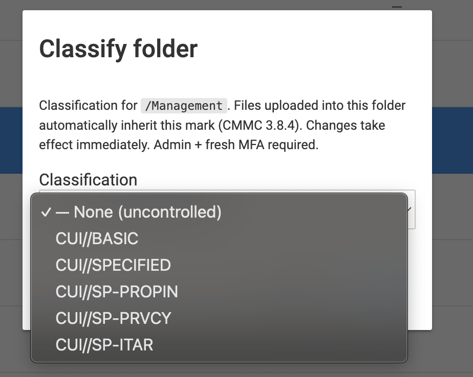

# Compliance posture — Open-CMMC deployed

**Scope:** this document describes the CMMC Level 2 / NIST SP 800-171 Rev 2
posture **after Open-CMMC is installed** on a RHEL 9 or AlmaLinux 9 FIPS host.
It is the positive counterpart to [`gap-analysis.md`](./gap-analysis.md),
which describes the pre-fork baseline of upstream `filebrowser/filebrowser`.

Every one of the 110 NIST 800-171 Rev 2 controls is listed. For each control
we state **who delivers it** in a default Open-CMMC deployment and **where the
evidence lives** (source path, config file, or SSP section).

## Legend

| Marker | Source | Meaning |
|---|---|---|
| ✅ | Open-CMMC | Implemented in the filebrowser binary or its bundled Keycloak-FIPS IdP |
| 🟢 | Wazuh | Delivered by the bundled Wazuh stack (enabled with `--with-wazuh`) |
| 📋 | Customer SSP | Policy / procedure control — documented in the customer's SSP, POA&M, or training records |
| 🏢 | Host / facility | Satisfied by the underlying RHEL 9 / AlmaLinux 9 host, LUKS, systemd, firewalld, physical facility, or network boundary (NGFW / Trout Access Gate) |
| ⚠️ | Open-CMMC, **off by default** | Implemented in the product but not enabled by the default installer. You must turn it on and evidence that you did, or the control is not met on your deployment |

## Headline numbers

| Source | Rows |
|---|---|
| ✅ Open-CMMC directly | 59 |
| ⚠️ Open-CMMC, off by default | 0 |
| 🟢 Wazuh (with `--with-wazuh`) | 20 |
| 📋 Customer SSP | 26 |
| 🏢 Host / facility | 29 |
| **Distinct controls** | **110** |

Counts are per-marker, so they sum to more than 110 — many controls are
shared between the product, the host, and your SSP. Open-CMMC contributes to
59 controls directly. Nothing in this table ships disabled by the
installer today; the ⚠️ marker is retained so any future off-by-default
control is impossible to miss. Adding the bundled Wazuh
stack extends coverage into monitoring-heavy families (3.3 audit retention,
3.4 config management, 3.6 incident response, 3.11 vulnerability scanning,
3.14 system integrity).

> **Read the rows, not the total.** Several controls are satisfied only when
> you supply something outside the product (egress filtering, media handling
> for backup archives, periodic at-rest re-scans) or complete an operator
> procedure (offboarding, disabling inactive accounts).
> Those rows say so explicitly. A control counted here is not automatically a
> control you can evidence on your own deployment.

---

## 3.1 — Access Control (22)

| ID | Short title | Source | Implementation | Evidence |
|---|---|---|---|---|
| 3.1.1 | Limit system access to authorized users | ✅ | OIDC authentication via bundled Keycloak or customer IdP; the installer sets `auth.method=oidc` so the local-password path is not reachable | `cmmc/auth/oidc/`, `config/install.sh`, `config/keycloak/bootstrap.sh` |
| 3.1.2 | Limit transactions to authorized functions | ✅ | Per-folder ACL evaluated on every request alongside user permission flags | `cmmc/authz/folderacl/`, `http/cmmc_folderacl.go` |
| 3.1.3 | Control flow of CUI per approved authorizations | ✅ | CUI marking model + marking-aware authz; public shares refused for CUI-marked files | `cmmc/marking/`, `http/cmmc_enforcement.go` |
| 3.1.4 | Separation of duties | ✅📋 | Four role presets (viewer / contributor / collaborator / admin) applied from Keycloak group membership; separation is admin-vs-non-admin. A distinct audit-admin role is **not** implemented — assign audit duties by admin-account provisioning in the SSP | `cmmc/authz/role.go`, `storage/bolt/authz.go`, Customer SSP |
| 3.1.5 | Least privilege | ✅ | Permissions default to `false` on user creation; config-review cadence documented in SSP | `users/permissions.go`, SSP |
| 3.1.6 | Non-privileged accounts for non-security functions | 📋 | Operator-policy control; SSP states admins have separate daily-use accounts | Customer SSP |
| 3.1.7 | Prevent non-priv users from priv functions; log attempts | ✅ | Admin check on every privileged handler; fresh-MFA denials emit `authz.priv.reject`; permission denials are recorded as the route's own event with `outcome=reject` | `http/auth.go`, `http/fresh_mfa.go`, `http/audit_wrapper.go` |
| 3.1.8 | Limit unsuccessful logon attempts | ✅ | Rate-limit middleware + Keycloak brute-force lockout (5 failures → 60 s increment, 900 s max, non-permanent) | `http/cmmc_ratelimit.go`, `config/keycloak/bootstrap.sh` |
| 3.1.9 | Privacy / security notices | ✅ | CUI use-and-consent notice rendered on the Keycloak login page via the realm `displayNameHtml` | `config/keycloak/bootstrap.sh` |
| 3.1.10 | Session lock with pattern hiding | ✅ | Idle-session middleware forces re-auth after 15 min inactivity | `http/cmmc_session_idle.go`, `cmmc/auth/session/idle.go` |
| 3.1.11 | Terminate session after condition | ✅ | 15 min app-side idle lock (installer default) + 8 h Keycloak absolute lifespan; logout revokes the session `jti` server-side | `cmmc/auth/session/`, `config/install.sh` |
| 3.1.12 | Monitor and control remote access | ✅🟢 | All sessions audited; Wazuh endpoint agents extend monitoring to operator workstations | `cmmc/audit/`, `config/wazuh/endpoints/` |
| 3.1.13 | Cryptographic mechanisms for remote access | ✅ | FIPS TLS profile: min TLS 1.2 (TLS 1.3 preferred), FIPS-approved cipher suites and P-256/P-384 curves only | `cmmc/crypto/tlsprofile/tlsprofile.go` |
| 3.1.14 | Route remote access via managed control points | 🏢 | Host firewall + NGFW (or Trout Access Gate) enforce the single ingress path | `docs/architecture.md` §3, customer NGFW |
| 3.1.15 | Authorize remote priv commands | ✅ | `withFreshMFA` requires an OIDC MFA assertion newer than `FB_OIDC_MFA_FRESH_SECONDS` (installer default 60 min) on privileged routes; no-op when auth method is not OIDC | `http/fresh_mfa.go`, `config/install.sh` |
| 3.1.16 | Authorize wireless access prior to connection | 🏢 | Host / network layer control | Customer network SSP |
| 3.1.17 | Protect wireless with authn + crypto | 🏢 | Host / network layer control | Customer network SSP |
| 3.1.18 | Control mobile device connections | 🏢 | MDM / endpoint policy | Customer MDM SSP |
| 3.1.19 | Encrypt CUI on mobile devices | 🏢 | Device-level FDE via MDM | Customer MDM SSP |
| 3.1.20 | Verify and control external-system connections | 🏢🟢 | Egress restriction is customer NGFW / host policy — `install.sh` opens only the two required inbound ports and configures no egress rules; Wazuh flags unexpected outbound on operator workstations | Customer NGFW, `config/wazuh/` |
| 3.1.21 | Limit portable storage on external systems | 📋 | Operator policy; SSP statement | Customer SSP |
| 3.1.22 | Control CUI on publicly accessible systems | ✅ | Share-creation refuses any file flagged with a non-NONE CUI mark | `http/cmmc_marking.go`, `http/share.go` |

## 3.2 — Awareness & Training (3)

| ID | Short title | Source | Implementation | Evidence |
|---|---|---|---|---|
| 3.2.1 | Security awareness | 📋 | Customer training program | Customer SSP |
| 3.2.2 | Role-based training | 📋 | Customer training program | Customer SSP |
| 3.2.3 | Insider-threat training | 📋 | Customer training program | Customer SSP |

## 3.3 — Audit & Accountability (9)

*In-product audit surface (3.3.1 / 3.3.2). The full durable stream is shipped to Wazuh / rsyslog; this per-user view is a "show me my own activity" affordance plus an admin audit tail for investigations.*

| ID | Short title | Source | Implementation | Evidence |
|---|---|---|---|---|
| 3.3.1 | Create and retain audit records | ✅ | Structured JSON events emitted on every auth, file, and admin action | `cmmc/audit/emitter.go`, `http/cmmc_audit.go` |
| 3.3.2 | Uniquely trace actions to user | ✅ | `user_id` + `correlation_id` stamped on every event | `cmmc/audit/correlation.go`, `cmmc/audit/event.go` |
| 3.3.3 | Review and update logged events | ✅📋 | Stable additive event schema documented in `cmmc/audit/event.go` (no version field; renames are an SSP-schema change); review cadence documented in SSP | `cmmc/audit/event.go`, Customer SSP |
| 3.3.4 | Alert on audit logging failure | 🟢 | Wazuh built-in agent-disconnect rules plus shipped rule 200050 on `audit.chain.verify.fail`; the local `/health` endpoint is liveness-only and carries no audit-subsystem signal | `config/wazuh/rules/filebrowser-cmmc.xml` |
| 3.3.5 | Correlate audit review | ✅ | Per-request correlation id flows through filebrowser, rsyslog, and SIEM | `cmmc/audit/correlation.go` |
| 3.3.6 | Record reduction and report generation | 🟢 | Wazuh dashboard + customer SIEM reporting | Wazuh dashboard, customer SIEM |
| 3.3.7 | Authoritative timestamp source | 🟢🏢 | chrony synced to authenticated NTS source; Wazuh verifies clock skew | `config/install.sh`, Wazuh agent config |
| 3.3.8 | Protect audit info and tools | ✅🟢 | Per-event HMAC-SHA-256 chain (HKDF-derived subkey) over journald → rsyslog-over-mTLS to the SIEM; Wazuh enforces manager-side retention. No local WORM spool; the `extra` field is excluded from the MAC (documented residual risk) | `cmmc/audit/chain.go`, `cmmc/audit/verify.go`, `config/wazuh/` |
| 3.3.9 | Limit audit mgmt to subset of priv users | ✅📋 | Audit read/verify endpoints restricted to the `admin` role. A distinct audit-admin role is **not** implemented — the SSP must assign audit duties by controlling admin-account provisioning | `http/auth.go`, `http/http.go`, Customer SSP |

## 3.4 — Configuration Management (9)

| ID | Short title | Source | Implementation | Evidence |
|---|---|---|---|---|
| 3.4.1 | Baseline configs and inventories | ✅🟢 | Opinionated FIPS baseline shipped; Wazuh FIM inventories binary + config paths | `config/`, `config/wazuh/endpoints/` |
| 3.4.2 | Enforce security config settings | ✅ | Runtime settings mutation is disabled outright (`settingsPutHandler` returns 405); boot refuses to start when `FB_OIDC_REQUIRE_FIPS=true` and the Go FIPS module is inactive | `http/settings.go`, `cmd/root.go` |
| 3.4.3 | Track, review, approve, log changes | ✅🟢📋 | Runtime settings changes are refused (405) and logged as `settings.update` with `outcome=reject`; configuration changes happen on disk and are caught by Wazuh FIM on `/etc/cmmc-filebrowser/`. Change **approval** is an SSP process — no in-product dual-auth workflow | `http/settings.go`, `cmmc/audit/event.go`, `config/wazuh/`, Customer SSP |
| 3.4.4 | Analyze security impact of changes | 📋 | Change-management procedure | Customer SSP |
| 3.4.5 | Access restrictions for change | ✅ | Admin role required for all config mutations | `users/permissions.go`, `http/settings.go` |
| 3.4.6 | Least functionality | ✅ | Command execution disabled at build (`enableExec=false`). Shares, previews, archives, and public endpoints remain registered but refuse CUI-marked content via `enforceCUIRead` | `cmmc/authz/role.go`, `http/cmmc_enforcement.go`, `http/public.go` |
| 3.4.7 | Restrict nonessential ports and services | 🏢🟢 | firewalld + Wazuh rootcheck `check_ports` / syscollector port inventory detects new listeners | `config/install.sh` phase_firewall, `config/wazuh/endpoints/` |
| 3.4.8 | Deny-by-exception software | 🏢 | SELinux enforcing + host package policy | RHEL SELinux |
| 3.4.9 | Control user-installed software | 🏢 | Host package policy | RHEL dnf policy |

## 3.5 — Identification & Authentication (11)

| ID | Short title | Source | Implementation | Evidence |
|---|---|---|---|---|
| 3.5.1 | Identify users, processes, devices | ✅ | Per-user OIDC identity + per-request session `jti`. Device-level x509 authentication is **not** implemented | `cmmc/auth/oidc/identity.go`, `cmmc/auth/session/` |
| 3.5.2 | Authenticate identities | ✅ | OIDC-delegated authentication (installer sets `auth.method=oidc`); the residual local-password path uses bcrypt and is unused under the OIDC deployment | `cmmc/auth/oidc/`, `users/password.go` |
| 3.5.3 | MFA for priv local + network, non-priv network | ✅ | Keycloak enforces TOTP or WebAuthn on every login | `config/keycloak/bootstrap.sh` |
| 3.5.4 | Replay-resistant authentication | ✅ | PKCE on OIDC flow + `jti` + nonce validation + revocation list | `cmmc/auth/oidc/pkce.go`, `cmmc/auth/session/mint.go` |
| 3.5.5 | Prevent identifier reuse | ✅ | Keycloak is the identifier authority with `editUsernameAllowed: false`; reuse is prevented at the IdP. Filebrowser user deletion is a hard delete, not a tombstone | `config/keycloak/bootstrap.sh` |
| 3.5.6 | Disable inactive identifiers | 📋 | Disabling inactive accounts is an operator procedure in the Keycloak console — no last-login cutoff is automated by Open-CMMC | Customer SSP, `docs/day2-operations.md` |
| 3.5.7 | Minimum password complexity | ✅ | Keycloak password policy: length 12, upper, lower, digit, special, not-username, history 5, 90-day expiry | `config/keycloak/bootstrap.sh` |
| 3.5.8 | Prohibit password reuse | ✅ | Keycloak password-history policy (5 generations). Raise `passwordHistory` in the realm if your SSP specifies more | `config/keycloak/bootstrap.sh` |
| 3.5.9 | Temporary password with immediate change | ✅ | Keycloak admin-set passwords flagged `UPDATE_PASSWORD` required action | `config/keycloak/bootstrap.sh` |
| 3.5.10 | Cryptographically-protected passwords | ✅ | Keycloak PBKDF2 under the FIPS profile is the authoritative credential store. The legacy local path uses bcrypt (**not** FIPS-approved) and is unused under the OIDC deployment the installer configures | Keycloak FIPS profile, `users/password.go` |
| 3.5.11 | Obscure authentication feedback | ✅ | Generic "invalid credentials" error; password fields masked in UI | `http/auth.go`, `frontend/src/views/Login.vue` |

## 3.6 — Incident Response (3)

| ID | Short title | Source | Implementation | Evidence |
|---|---|---|---|---|
| 3.6.1 | Operational IR capability | 🟢 | Wazuh correlation rules turn audit events into SOC-actionable incidents | `config/wazuh/rules/filebrowser-cmmc.xml` |
| 3.6.2 | Track and report incidents | 🟢 | Wazuh manager → customer SIEM; DFARS 72 h reporting procedure in SSP | Wazuh dashboard, Customer SSP |
| 3.6.3 | Test IR capability | ✅🟢 | Audit-chain verifier + tabletop procedure; Wazuh replay capability | `cmmc/audit/verify.go`, Wazuh |

## 3.7 — Maintenance (6)

| ID | Short title | Source | Implementation | Evidence |
|---|---|---|---|---|
| 3.7.1 | Perform maintenance | 📋 | Customer maintenance procedure | Customer SSP |
| 3.7.2 | Control tools and personnel | 📋 | Customer procedure | Customer SSP |
| 3.7.3 | Sanitize diagnostic media | 🏢 | Host / media handling policy | Customer SSP |
| 3.7.4 | Check diagnostic media for malware | 🏢 | Host AV / media scanning | Customer SSP |
| 3.7.5 | MFA for nonlocal maintenance | ✅ | Admin sessions inherit Keycloak MFA; step-up required for priv ops | `http/fresh_mfa.go` |
| 3.7.6 | Supervise maintenance without access | 📋 | Customer procedure | Customer SSP |

## 3.8 — Media Protection (9)

*Folder-level CUI marking (3.8.4). Files uploaded into a marked folder inherit the mark; admin + fresh MFA gate every change.*

*Per-file override and declassification flow (3.8.4 / 3.3.1). The reason is mandatory and stamped into the audit record.*

| ID | Short title | Source | Implementation | Evidence |
|---|---|---|---|---|
| 3.8.1 | Protect CUI on system media | ✅🏢 | Per-file AES-256-GCM envelope via an interposed afero FS; wrapped DEKs are stored in BoltDB, which is itself plaintext and relies on host LUKS | `cmmc/crypto/envelope/`, `storage/bolt/envelope.go`, host LUKS |
| 3.8.2 | Limit access to CUI media to authorized users | ✅ | Folder ACL + CUI-marking-aware authorization on every read | `cmmc/authz/folderacl/`, `http/cmmc_enforcement.go` |
| 3.8.3 | Sanitize / destroy media before disposal | 🏢 | Host crypto-shred of KEK + LUKS destroy | Customer SSP |
| 3.8.4 | Mark media with CUI markings | ✅ | File-level CUI mark + UI badge + download confirmation dialog | `cmmc/marking/`, `frontend/src/components/files/CuiBadge.vue` |
| 3.8.5 | Control access to media during transport | 📋 | `install.sh backup` produces an archive that **contains the KEK in the clear**; protection in transport is the customer's media-handling control | `docs/backup-restore.md`, Customer SSP |
| 3.8.6 | Cryptographic mechanisms for CUI in transport | ✅📋 | FIPS TLS profile on the inbound listener; outbound OIDC/SIEM channels inherit the FIPS runtime's narrowed suite set. Backup archives are not independently encrypted — see 3.8.9 | `cmmc/crypto/tlsprofile/`, Customer SSP |
| 3.8.7 | Control use of removable media | 🏢 | Host USB / removable-media policy | Customer SSP |
| 3.8.8 | Prohibit portable storage without identifiable owner | 🏢 | Host policy | Customer SSP |
| 3.8.9 | Protect backup CUI confidentiality | 📋 | Independent backup-key custody is **not** implemented; the backup archive carries the KEK alongside the ciphertext. Document a compensating control (encrypted removable media, offline custody, two-person access) | `docs/backup-restore.md`, Customer SSP |

## 3.9 — Personnel Security (2)

| ID | Short title | Source | Implementation | Evidence |
|---|---|---|---|---|
| 3.9.1 | Screen individuals prior to access | 📋 | Customer HR process | Customer SSP |
| 3.9.2 | Protect CUI during personnel actions | ✅📋 | Disable the account in Keycloak and sign out its sessions; an already-issued filebrowser session otherwise survives until idle-lock or expiry (up to 8 h). Automatic revocation on termination is not implemented — see the offboarding procedure | `config/keycloak/bootstrap.sh`, `docs/day2-operations.md` |

## 3.10 — Physical Protection (6)

| ID | Short title | Source | Implementation | Evidence |
|---|---|---|---|---|
| 3.10.1 | Limit physical access | 🏢 | Customer facility controls | Customer SSP |
| 3.10.2 | Protect/monitor physical facility | 🏢 | Customer facility controls | Customer SSP |
| 3.10.3 | Escort visitors | 🏢 | Customer procedure | Customer SSP |
| 3.10.4 | Maintain audit logs of physical access | 🏢 | Customer facility logs | Customer SSP |
| 3.10.5 | Control + manage physical access devices | 🏢 | Customer procedure | Customer SSP |
| 3.10.6 | Enforce safeguarding at alternate work sites | 🏢 | Customer remote-work policy | Customer SSP |

## 3.11 — Risk Assessment (3)

| ID | Short title | Source | Implementation | Evidence |
|---|---|---|---|---|
| 3.11.1 | Periodically assess risk | 📋 | Customer risk-assessment program | Customer SSP |
| 3.11.2 | Scan for vulnerabilities | 🟢 | Wazuh Vulnerability Detector + govulncheck/trivy in release CI | `config/wazuh/`, `.github/workflows/cmmc-supply-chain.yaml` |
| 3.11.3 | Remediate vulnerabilities | 🟢 | Wazuh tracks open CVEs; patch SLA documented in SSP | Wazuh dashboard, Customer SSP |

## 3.12 — Security Assessment (4)

| ID | Short title | Source | Implementation | Evidence |
|---|---|---|---|---|
| 3.12.1 | Periodically assess controls | 📋 | Customer assessment program | Customer SSP |
| 3.12.2 | Plan of Action and Milestones | 📋 | Customer POA&M | Customer SSP |
| 3.12.3 | Continuous monitoring | ✅🟢 | On-demand audit-chain verification over the last 1000 buffered events via the admin API, plus Wazuh continuous monitoring of the durable stream | `cmmc/audit/verify.go`, `http/cmmc_audit.go`, Wazuh |
| 3.12.4 | System Security Plan | ✅ | Open-CMMC ships SSP source material (this doc + gap-analysis + architecture) | `docs/` |

## 3.13 — System & Communications Protection (16)

| ID | Short title | Source | Implementation | Evidence |
|---|---|---|---|---|
| 3.13.1 | Boundary protection | 🏢 | Customer NGFW / Trout Access Gate | `docs/architecture.md` §3 |
| 3.13.2 | Security-promoting designs | ✅ | Per-user afero `BasePathFs` sandbox + CSP (`default-src 'self'`, inline styles permitted) + HSTS / nosniff / DENY / no-referrer on every response | `http/http.go`, `users/users.go` |
| 3.13.3 | Separate user functionality from system management | ✅📋 | Admin routes are gated by `withAdmin` and fresh-MFA on the same listener as user routes; `--socket` and `--address` are mutually exclusive, so a separate admin listener is **not** deployed. Network-level separation of the admin surface is a customer control | `http/auth.go`, `http/http.go`, Customer SSP |
| 3.13.4 | Prevent unauthorized info transfer via shared resources | ✅ | Go runtime + afero scoping; single-tenant memory model | `users/users.go`, afero |
| 3.13.5 | Subnets for publicly accessible components | ✅🏢 | Public share endpoints are registered and serve non-CUI files, but hard-refuse CUI-marked content; network isolation of public components is the customer's NGFW / DMZ | `http/public.go`, Customer NGFW |
| 3.13.6 | Default-deny network traffic | 🏢 | Host firewalld default zone plus customer NGFW deny-by-default. `install.sh` opens only the filebrowser and Keycloak inbound ports and enforces no egress allowlist | `config/install.sh` phase_firewall, Customer NGFW |
| 3.13.7 | Prevent split tunneling | 🏢 | Host / endpoint policy | Customer SSP |
| 3.13.8 | Cryptographic mechanisms for CUI in transit | ✅ | FIPS TLS profile: min TLS 1.2 (TLS 1.3 preferred), FIPS-approved cipher suites and P-256/P-384 curves only | `cmmc/crypto/tlsprofile/` |
| 3.13.9 | Terminate connections at session end or inactivity | ✅ | `ReadHeaderTimeout` (60 s) on the HTTP server + session idle middleware enforcing the 15 min idle lock | `cmd/root.go`, `http/cmmc_session_idle.go` |
| 3.13.10 | Establish and manage crypto keys | ✅📋 | Per-file DEKs wrapped by a 32-byte KEK generated at install and held as a `0400` file owned by the service account, protected by filesystem permissions and SELinux. **Not** TPM-sealed or HSM-held, and KEK rotation on a populated cabinet is not automated — custody and escrow are SSP controls | `cmmc/crypto/envelope/`, `cmmc/crypto/keyderive/`, `docs/backup-restore.md` |
| 3.13.11 | FIPS-validated cryptography | ✅ | Built with `GOFIPS140=v1.0.0` (Go Cryptographic Module v1.0.0); runtime posture asserted at boot via `crypto/fips140.Enabled()`. The `install.sh` build is `CGO_ENABLED=0` and does not link RHEL OpenSSL; the container images (`Dockerfile.alma9`, `Dockerfile.rhel-ubi`) additionally cgo-link CMVP #4774 | `cmmc/crypto/fips/`, `config/install.sh` |
| 3.13.12 | Prohibit remote activation of collaborative devices | 🏢 | No cameras / mics on server role | Customer SSP |
| 3.13.13 | Control mobile code | ✅ | CSP `default-src 'self'` with no `script-src` override blocks inline scripts, set in the root-router security-headers middleware | `http/http.go` |
| 3.13.14 | Control VoIP | 🏢 | N/A for file server role | Customer SSP |
| 3.13.15 | Protect authenticity of communications sessions | ✅ | FIPS TLS + HSTS (`max-age=63072000; includeSubDomains; preload`) on every response. Client-certificate (mTLS) authentication for user sessions is **not** implemented | `cmmc/crypto/tlsprofile/`, `http/http.go` |
| 3.13.16 | Confidentiality of CUI at rest | ✅🏢 | Per-file AES-256-GCM envelope encryption on cabinet files. The BoltDB metadata store holds the wrapped DEKs and is **not** application-encrypted — it is protected by host LUKS | `cmmc/crypto/envelope/`, `storage/bolt/envelope.go`, host LUKS |

## 3.14 — System & Information Integrity (7)

| ID | Short title | Source | Implementation | Evidence |
|---|---|---|---|---|
| 3.14.1 | Flaw remediation | ✅🟢 | govulncheck + trivy + SBOM in CI; Wazuh CVE correlation on host packages | `.github/workflows/cmmc-supply-chain.yaml`, `config/wazuh/` |
| 3.14.2 | Protection from malicious code | ✅🟢 | ClamAV INSTREAM scan-on-upload, fail-closed. The installer provisions `clamd` on loopback and sets `FB_CMMC_AV=required`; boot refuses to start if required mode cannot attach a scanner. Infected upload → 422, unreachable scanner → 503. Wazuh rootcheck + platform AV cover the host | `cmmc/scan/clamav/`, `cmd/root.go`, `config/install.sh` phase_clamav |
| 3.14.3 | Monitor security alerts and advisories | 🟢 | Wazuh rule feed + customer SSP subscription procedure | `config/wazuh/`, Customer SSP |
| 3.14.4 | Update malicious-code protection | ✅📋 | The installer enables `clamav-freshclam` for automatic signature updates and `install.sh status` reports signature age (flags >7 days as stale). Air-gapped sites point `/etc/freshclam.conf` at an internal mirror; alerting on staleness is an SSP/monitoring control | `config/install.sh` phase_clamav, Customer SSP |
| 3.14.5 | Periodic and real-time scans of external files | ✅📋 | Real-time scan on every upload, enabled by default (see 3.14.2). Periodic re-scan of at-rest files is **not** implemented — cover with a host-level scheduled `clamdscan` | `cmmc/scan/scanner.go`, Customer SSP |
| 3.14.6 | Monitor inbound/outbound for attacks | 🟢 | Wazuh agents on filebrowser host + operator endpoints | `config/wazuh/endpoints/` |
| 3.14.7 | Identify unauthorized use | 🟢 | Wazuh anomaly rules + audit correlation | `config/wazuh/rules/filebrowser-cmmc.xml` |

---

## How to use this document in an assessment

1. **Populate the SSP.** Copy each row into the customer SSP under the corresponding control, adding organization-specific ODPs (retention periods, review cadences, role assignments).
2. **Collect the evidence.** Each `Evidence` cell points at either a source-tree path (reproducible via the tagged release) or an operational artifact (Wazuh dashboard export, SSP section). File the evidence set with the SSP.
3. **Complete the POA&M.** Rows marked 📋 or 🏢 are customer-side work items; track any that aren't yet documented in a POA&M until they are.
4. **Confirm what is actually running.** `sudo config/install.sh status` reports the antivirus posture (configured mode, clamd reachability, signature age) alongside unit health. Capture that output as evidence. If any ⚠️ row appears in this document, it is a control the product implements but your deployment has not enabled — an unenabled control is a finding, not a feature.
5. **Demonstrate audit-chain integrity.** Call `GET /api/cmmc/audit/verify` as an admin before the assessment window. (There is no `cmmc-filebrowser audit verify` subcommand — the verifier is reachable only over the admin API.)
6. **Prove you can recover.** Run a restore drill per [`backup-restore.md`](./backup-restore.md) and file the result. The KEK is not escrowed by the product; your media handling is the control.

See also:
- [`gap-analysis.md`](./gap-analysis.md) — pre-fork baseline showing why these controls were added.
- [`architecture.md`](./architecture.md) — data-flow diagrams and topology the controls live in.

## Optional: shop-floor SMB delivery

Enabled with `config/smb/install-smb.sh` (see [`smb-shop-floor.md`](./smb-shop-floor.md)). The cabinet is not exported; files are released into, and taken back from, a Samba container that runs on the same host and serves the OT-side interface only. These rows add to — never replace — the ones above.

| Control | Requirement | Source | Implementation | Evidence |
|---|---|---|---|---|
| 3.1.3 | Control flow of CUI | ✅ | Release is an explicit, audited, per-cell action behind a distinct *Release* folder permission and fresh MFA; ITAR-marked files are refused for non-ITAR cells | `cmmc/otrelease/release.go`, `http/cmmc_otrelease.go`, audit `file.release.ot` |
| 3.1.14 / 3.13.1 / 3.13.6 | Managed control point; deny by default | ✅🏢 | Port 445 published through the podman bridge so every packet traverses host firewalld. Dedicated OT NIC or VLAN (default when present): `ot` zone, target DROP, rich rules for the inventoried machine addresses only. Single-NIC alias mode: the OT address shares the LAN NIC; rules are keyed on that destination address (accept per machine, then drop) — deny-by-default holds, physical separation does not, and the SSP must say which mode is deployed. `ip_forward=0`; HTTPS stays on the LAN address | `config/smb/install-smb.sh`, `/etc/cmmc-smb/firewalld.sh`, `/etc/cmmc-smb/render.env` (`ALIAS=`), `firewall-cmd --list-rich-rules` |
| 3.3.1 / 3.3.2 | Audit records, traceability | ✅🟢 | `file.release.ot`, `file.release.revoke`, `file.intake.ot`, `file.intake.reject` in the HMAC chain; Samba `full_audit` (`client IP | machine | account | share`) to the host journal via `/dev/log` | `cmmc/audit/event.go`, `smb/render/render.go`, journal facility local5 |
| 3.4.1 / 3.4.2 | Baseline configuration | ✅🟢 | Every share, address rule, container account and SSP row is rendered from one inventory file; the rendered tree and the pinned image digest are under Wazuh FIM | `/etc/cmmc-smb/`, `cmmc-smb render` |
| 3.5.1 / 3.5.2 | Identify and authenticate devices | ✅📋 | Default (`auth: none`): the machine is identified by its fixed source address on a cell the operator has attested as a Protected Distribution System — the loader refuses the combination otherwise; each such machine has its own share pair mapped to its own Unix identity, so audit and the return folder still name the machine. Optional (`auth: password`): one account per machine, NTLMv2, 24-character generated password shown once. The SSP states which machines use which | `cells.yaml` `auth:`, `cmmc-smb ssp-table` (Auth column), `smb.conf` `force user` / `valid users` + `hosts allow` |
| 3.8.4 | Mark media | ✅ | The CUI mark travels in the release manifest and is inherited by every file taken back from the cell | `cmmc/otrelease/intake.go` |
| 3.13.8 / 3.13.15 | Confidentiality and authenticity in transit | ✅🏢 | Password + SMB3 machines: encryption required on the share (the only posture allowed in a cell without a PDS). Everything else — no-password machines, SMB2, SMB1 — is plaintext on the wire and is allowed only on a Protected Distribution System the operator attests per cell (`pds_attested`); the loader refuses otherwise | `cells.yaml`, PDS photos + diagram filed with the SSP |
| 3.13.11 | FIPS-validated cryptography | ✅📋 | The host, TLS, JWT, envelope encryption and LUKS are unchanged. The Samba container is a non-validated userspace (NTLMv2 requires MD4); the SSP lists it as such and states which control confidentiality on the shop-floor hop relies on (PDS, with encryption as defense in depth) | `cmmc-smb ssp-table` crypto-module row |
| 3.13.16 | CUI at rest | ✅🏢 | Released files are plaintext inside the host's LUKS volume, limited to the currently released set (TTL / revoke); returned files are encrypted on filing | `cmmc/otrelease/release.go`, host LUKS |
| 3.14.2 / 3.14.5 | Malicious code | ✅ | Returned files pass an allow-list content gate, then ClamAV, before filing; the feature refuses to start unless AV is in required mode; rejects are quarantined with a reason | `cmmc/otrelease/gate.go`, `cmd/root.go` |
| — | Specialized assets (OT) | 📋 | Controllers are documented in the asset inventory, SSP and network diagram; `cmmc-smb ssp-table` prints the rows | Customer SSP |
