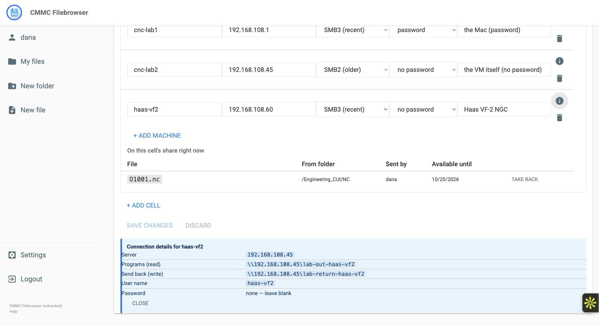

# Shop-floor SMB delivery

Send NC programs from the cabinet to CNC controllers over SMB, and take
their output back, from the Open-CMMC host you already run — no second
appliance. Written for the two-person IT team that also has to keep
the machines cutting.

Install and first boot: [`almalinux9-setup.md`](./almalinux9-setup.md).
Day-2: [`day2-operations.md`](./day2-operations.md).

---

## The short version

| Task | Command / place | Cadence |
|---|---|---|
| Describe your cells and machines | web UI → **Settings → Shop floor** (add/remove cells and machines, rename, change addresses; applied within seconds). Or edit `/etc/cmmc-smb/cells.yaml` by hand | when a machine is added or moved |
| Enable the feature | `sudo config/install.sh deploy --with-smb --ot-ip <address>` — or, after deploy, `sudo config/smb/install-smb.sh --ot-ip <address>` | once |
| Set up a machine | `sudo cmmc-smb useradd <machine>` — prints the controller setup card (no password by default; if the machine has `auth: password`, it is shown once) | per machine |
| Re-print a card (no password) | `cmmc-smb card <machine>` | as needed |
| Send a program to a cell | web UI → select the file → **Send to shop floor** (robot-arm icon) → pick the cell | daily use |
| See what is on a cell's share | **Settings → Shop floor**, under the cell (or `GET /api/cmmc/ot/released?cell=<cell>`) | as needed |
| Pull a program back off the floor | **Settings → Shop floor** → **Take back** (or `DELETE /api/cmmc/ot/release`) | as needed; expiry does it automatically |
| Machine output back into the cabinet | automatic — appears under `<return_path>/<machine>/` within about a minute | — |
| SSP rows | `cmmc-smb ssp-table --cells /etc/cmmc-smb/cells.yaml --image <ref>` | each assessment cycle |

`--ot-ip` is the only required input: the address the controllers will
connect to. The installer finds the network interface itself (see
*Network* below), loads the container images from the release tarball,
and starts a bundled ClamAV container if no scanner is answering — the
enclave will not run the return path without one.

## How it works

The cabinet is never exported. Two directories on the host are:

```
/srv/cmmc-filebrowser/ot/out/<cell>/            released programs — read-only share per cell
/srv/cmmc-filebrowser/ot/return/<cell>/<machine>/  drop folder — one per machine, write share
```

A Samba container (`cmmc-smb`, podman, like the bundled Keycloak) serves
those two trees on the OT-side interface only. The enclave process does
the rest:

- **Release** — an admin, or a user with the folder's *Release* grant,
  picks a file and a cell. The file is decrypted from the cabinet,
  written atomically into the cell's out share with a manifest
  (SHA-256, CUI mark, who, when, expiry), and recorded in the audit chain
  as `file.release.ot`. ITAR-marked files only go to ITAR-designated
  cells. Releases expire after the cell's TTL (default 30 days) unless
  pinned by an admin.
- **Return** — anything a machine writes into its drop folder is picked
  up once it has stopped changing, copied into a private quarantine,
  checked (allowed extension, size, daily quota, no executable or
  archive content, text only), scanned by ClamAV, and only then filed
  into the cabinet under the cell's `return_path`, inheriting the cell's
  CUI mark, never overwriting an existing file. Rejects stay in
  `/srv/cmmc-filebrowser/ot/quarantine/rejected/` with a `.reason` file.
  Every accept and reject is an audit event.

Everything is driven by one file, `cells.yaml`: the shares, which
address each machine may connect from, the host firewall rules, the
Unix accounts inside the container, the enclave's release targets and
the SSP asset rows all come from it.

---

## Before you start: the physical path

Machines connect **without a password by default**. A controller is then
identified by its network address and by the cable — so the cell must be
a **Protected Distribution System**: cabling in conduit or inside locked
electrical cabinets, on a switch dedicated to the cell, no wireless,
cabinet access controlled. Set `pds_attested: true` on the cell; the
installer refuses a no-password machine without it. File photos and a
labelled diagram with your SSP.

If you would rather give a machine a password (`auth: password` on the
machine), `cmmc-smb useradd` generates one and prints it once. A password
also buys wire protection: SMB3-capable controllers (Haas NGC, Mazak
Smooth, Okuma OSP-P, Sinumerik One…) then get an encrypted share, which is
the only way to run a cell that is *not* a PDS; SMB2/SMB1 controllers stay
plaintext on the wire either way and always need the PDS.

A password-less session has no signing or encryption — there is no key to
derive them from. That is the trade: fewer keypad entries, cable as the
control.

## Setup

1. **Inventory.** After the first enable (step 3) the page **Settings →
   Shop floor** is where cells and machines live: add a cell, give each
   machine a name and its address, tick the protected-cable box, save.
   The server re-renders the shares and firewall within seconds and shows
   *applied* next to the server address. For the very first run, or if
   you prefer a file, copy `config/smb/cells.example.yaml` to
   `/etc/cmmc-smb/cells.yaml` and edit it (every field is explained
   there; `cmmc-smb validate` checks it). Both edit the same file.

   

   Under each cell the page lists what is on its share right now, with
   **Take back** per file, and the ⓘ next to a machine shows what to type
   into the controller:

   
2. **Network.** Three shapes, picked automatically from what the host has:
   - **Second NIC** (recommended): the installer uses the interface that
     carries no default route. Its firewall zone drops everything except
     445 from the listed machines.
   - **One NIC, managed switch**: `--ot-vlan 20` creates an 802.1Q
     sub-interface on the LAN NIC; same zone treatment.
   - **One NIC, no VLAN** (alias mode): with neither of the above, the OT
     address is added as an alias on the LAN NIC and the firewall keys on
     that address (accept 445 per machine, drop otherwise). Deny-by-default
     holds; physical separation does not — your SSP must say this mode is
     in use. Fine to start with; move to a NIC or VLAN when you can.
   Either way the HTTPS listener stays on the LAN address and the host
   does not forward between the two.
3. **Enable.**
   ```
   sudo config/install.sh deploy --with-smb --ot-ip 10.20.0.5      # fresh host
   sudo config/smb/install-smb.sh --ot-ip 10.20.0.5                 # existing host
   ```
   Returned files are scanned before they touch the cabinet, so the
   enclave refuses to run shop-floor delivery without antivirus in
   required mode. If nothing answers on the scanner address, the
   installer starts the bundled ClamAV container (loopback :3310) with a
   daily signature timer; `--no-clamav` opts out.
4. **The card.** For each machine: `sudo cmmc-smb useradd <machine>`.
   It prints a setup card — server address, the two share paths, user
   name, password (or "none"), dialect — in the order the controller's
   network-share screen asks for them. For `auth: password` machines the
   password is shown once and stored nowhere else; take the card to the
   machine and re-run to rotate. `cmmc-smb card <machine>` re-prints any
   card without the password.
5. **Controller.** Type the card in. SMB2-only controllers in a mixed cell
   get `-signed` share names; the card already shows the right ones. The
   ⓘ button next to a machine on the Shop floor page shows the same
   details.
6. **Grant release rights** (optional). Admins can always release. To
   let a programmer release from a folder without admin rights, add a
   folder permission entry with *Release* — it is a separate grant from
   read/write and is never inherited from cabinet defaults.
7. **Daily use.** In the file listing, select a program and click the
   robot-arm icon in the toolbar:

   

   Pick the cell; leave the days blank for the cell's default:

   

   

---

## Legacy SMB1 controllers

Machines marked `dialect: smb1` are served by a second container
(`cmmc-smb-legacy`) on a second OT-side address (`--legacy-ip`). SMB1
cannot be signed, so these cells require the PDS attestation, and the
circumstance is written into your SSP as an enduring exception with the
controllers as its subject (`cmmc-smb ssp-table` prints the row). Some
SMB1-era controllers only speak NTLMv1; that is a further per-cell
relaxation to validate on the bench before enabling.

---

## What the SSP says

`cmmc-smb ssp-table` prints three things to paste in:

- the **asset inventory rows** for every controller (specialized
  assets — OT), with cell, address, dialect and PDS status;
- the **cryptographic module row** for the Samba container: it is a
  deliberately non-validated userspace (NTLMv2 needs MD4, which the
  FIPS-mode host refuses) used for device authentication, SMB2 signing
  and SMB3 encryption on the shop-floor hop — the host's own FIPS
  posture is unchanged;
- the **enduring-exception row**, only if SMB1 cells exist.

Evidence the assessor will ask for: the PDS photos and diagram per
attested cell, the audit events (`file.release.ot`, `file.intake.ot`,
`file.intake.reject`, and the Samba `full_audit` records in the host
journal), `/etc/cmmc-smb/` under Wazuh file-integrity monitoring, and
the firewalld `ot` zone listing.

---

## Troubleshooting

| Symptom | Check |
|---|---|
| Controller cannot see the share | `firewall-cmd --zone=ot --list-rich-rules` includes its address; `podman logs cmmc-smb` shows the connect; the machine's `ip` in `cells.yaml` matches what it actually uses |
| Login fails | `sudo cmmc-smb useradd <machine>` again (rotates); confirm the account is in the right container (SMB1 machines → legacy) |
| Released file not on the share | `GET /api/cmmc/ot/released?cell=…`; check the TTL; audit log for `file.release.revoke` with reason `ttl` |
| Returned file never appears in the cabinet | it is still changing (wait a minute), or it was rejected — look in `quarantine/rejected/<cell>/` and the `.reason` file, or held because ClamAV is down — `systemctl status clamd@scan` |
| Service will not start after enabling | `journalctl -u cmmc-filebrowser` — usually `FB_CMMC_AV` is not `required`, or `cells.yaml` does not validate |

Before the first production cell, run `config/smb/spike.sh` on the host:
it builds the container, creates a throwaway inventory and proves NTLMv2
login, SMB3 encryption, mandatory signing, SMB1 refusal and the
read-only / write-only share split end to end.
